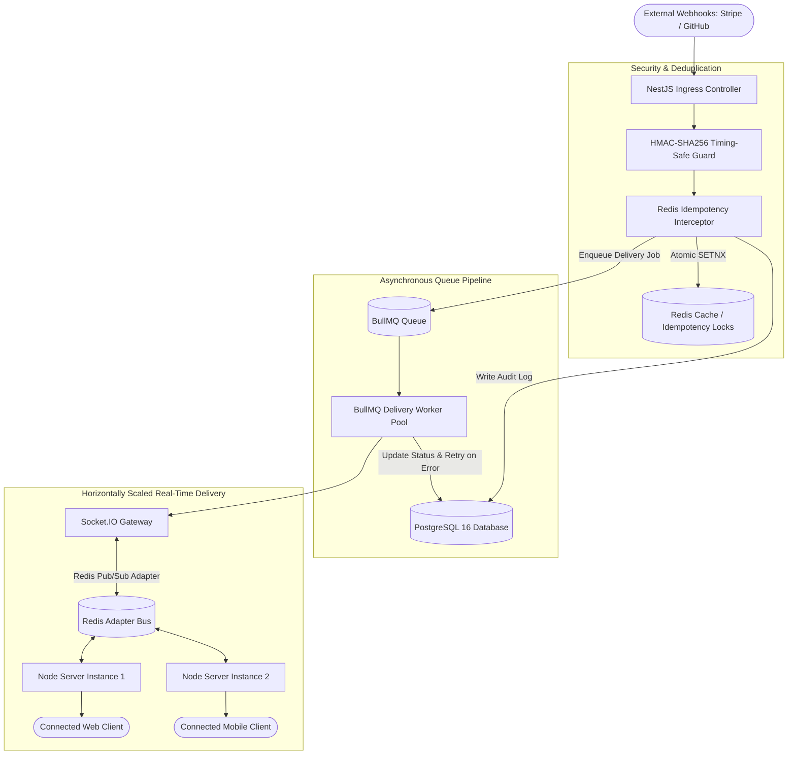
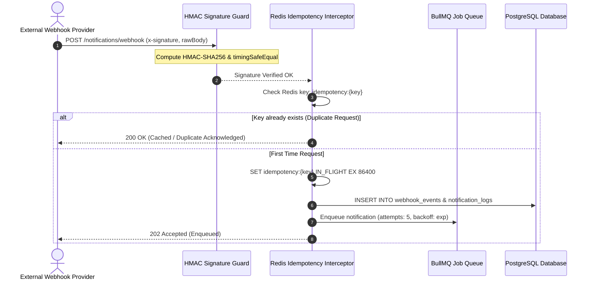

# Event-Driven Real-Time Notification Service

[](https://github.com/kuhaad-dev/realtime-notifications/actions)


A scalable, fault-tolerant **Event-Driven Notification Service** built with NestJS, PostgreSQL, Redis, Socket.IO, and BullMQ. Features secure **webhook ingestion with timing-safe HMAC-SHA256 signature verification**, **distributed Redis idempotency deduplication**, a **resilient BullMQ queue with exponential backoff retries**, and **horizontally scalable real-time WebSocket delivery via the Socket.IO Redis Streams adapter**.

---

## Architectural Highlights

- **Cryptographically Secure Webhook Ingestion**: Validates timing-safe HMAC-SHA256 signatures (`crypto.timingSafeEqual`) on raw body buffers with tolerance-window timestamp checks to prevent replay attacks.
- **Distributed Idempotency-Key Deduplication**: Uses atomic Redis lock predicates (`SETNX` with TTL) and response memoization to guarantee exactly-once processing across high-frequency duplicate requests.
- **Resilient BullMQ Job Queues**: Configured with exponential backoff retry policies (`attempts: 5`, initial delay: 2s) and Dead-Letter Queue (DLQ) retention for failed deliveries.
- **Horizontal WebSocket Scaling**: Uses `@socket.io/redis-adapter` to distribute room broadcasting across multiple Node.js cluster processes and Kubernetes pods, allowing clients connected to different server instances to receive real-time events without dropped packets.
- **Persistent Delivery Audit Trail**: PostgreSQL 16 schema capturing comprehensive event logs (`NotificationLog`, `WebhookEvent`, `DeviceSubscription`) with composite indexing for sub-millisecond retrieval.

---

## System Architecture



---

## Webhook Ingestion & Deduplication Flow



---

## REST & WebSocket API Reference

### HTTP Endpoints

| Method | Endpoint | Description | Headers |
|---|---|---|---|
| `POST` | `/notifications/webhook` | Ingest external webhook | `x-signature`, `x-timestamp` |
| `POST` | `/notifications/dispatch` | Manually dispatch notification | `Idempotency-Key` (optional) |
| `GET` | `/notifications/logs` | Fetch delivery audit logs | Query: `recipientId` |
| `GET` | `/notifications/metrics` | Real-time WebSocket connection count | None |

Interactive OpenAPI documentation is hosted at `http://localhost:3001/api/docs`.

### WebSocket Events (`/notifications` Namespace)

| Event | Direction | Payload | Description |
|---|---|---|---|
| `subscribe_channel` | Client -> Server | `{ "channel": "orders:123" }` | Join a specific pub/sub channel |
| `unsubscribe_channel`| Client -> Server | `{ "channel": "orders:123" }` | Leave a channel |
| `notification` | Server -> Client | `{ "notificationId", "title", "payload" }` | Real-time delivery payload |
| `[eventType]` | Server -> Client | Custom typed payload | Direct event-type specific payload |

---

## Local Setup & Quickstart

### Prerequisites
- Node.js 22+
- Docker & Docker Compose

### 1. Clone & Install
```bash
git clone https://github.com/kuhaad-dev/realtime-notifications.git
cd realtime-notifications
npm install
```

### 2. Start PostgreSQL & Redis
```bash
docker compose up -d postgres redis
```

### 3. Run Application
```bash
# Development mode
npm run start:dev

# Production build
npm run build
npm run start:prod
```

### 4. Run Automated Tests
```bash
# Unit test suite
npm run test

# End-to-end delivery & deduplication tests
npm run test:e2e
```

---

## Author

**Mayank Kuhaad**
- GitHub: [@kuhaad-dev](https://github.com/kuhaad-dev)
- Email: [mayankkuhaad@gmail.com](mailto:mayankkuhaad@gmail.com)
- LinkedIn: [linkedin.com/in/mayank-kuhaad](https://linkedin.com/in/mayank-kuhaad)